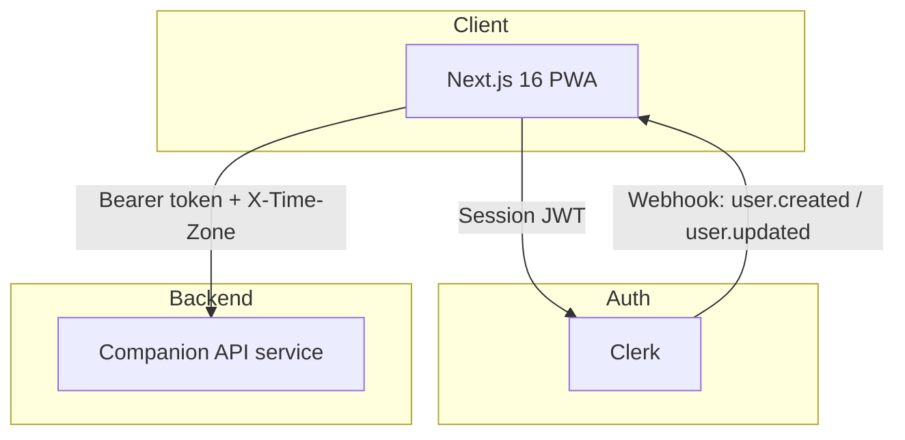

<!-- TODO: add logo — e.g.  -->

# Parla — Learn Italian

> **Live demo:** _Deploy and add your URL here_

A Duolingo-style Italian learning Progressive Web App. Work through a CEFR-graded curriculum of translation, matching, fill-in-the-blank, and listening exercises, earn XP and level up, keep a daily streak, and review vocabulary with SM-2 spaced repetition — installable on iOS/Android/desktop, themeable, and built with accessibility as a first-class concern.


<!-- TODO: add screenshots/GIF — e.g.
## Screenshots

| Dashboard | Lesson | Review |
|---|---|---|
|  |  | 
-->

## Overview

Parla is the frontend of a two-service architecture: this app owns routing, UI, gamification presentation, PWA installability, and auth flows, while a companion backend service (not part of this repository) owns the curriculum content, progress/XP/streak state, hearts, and the SM-2 spaced-repetition engine. The frontend is a thin client — every meaningful piece of learning state is fetched from and mutated through that API, with the UI applying optimistic updates where it matters (hearts, progress) for responsiveness.

## Tech stack

| Layer      | Technology                                                         |
| ---------- | ------------------------------------------------------------------ |
| Framework  | Next.js 16 (App Router, Turbopack), React 19, TypeScript           |
| Styling    | Tailwind CSS v4, custom design tokens, `class-variance-authority`  |
| Animation  | Framer Motion 12 + CSS keyframes, `prefers-reduced-motion`-aware   |
| Auth       | Clerk (`@clerk/nextjs`), Svix-verified webhooks                    |
| PWA        | Serwist (service worker, offline fallback, installability)         |
| Theming    | `next-themes` (light/dark/system), synced to Clerk's own theme     |
| Content    | `react-markdown` + `remark-gfm` (legal pages, guidebook)           |
| Moderation | `obscenity` profanity filter for usernames                         |
| Testing    | Vitest (unit), Playwright (e2e)                                    |
| Tooling    | ESLint (+ `eslint-plugin-jsx-a11y`), Prettier, Husky + lint-staged |

## Architecture



## Features

### Learning experience

- **CEFR-graded curriculum hierarchy** — sections (A1/A2) → thematic units → lessons → exercises, with a per-unit **guidebook** of grammar tips and example phrases (`/guidebook/[unitId]`)
- **Unit map** — Duolingo-style wavy lesson path with locked / unlocked / completed node states, auto-scrolling to the learner's current lesson, animated current-node pulse
- **4 exercise types**, all implemented and exercised in the lesson engine:
  - Translation — multiple choice with arrow-key navigation and shake-on-wrong feedback
  - Word match — tap Italian ↔ English pairs
  - Fill in the blank — free-text input with lenient answer matching
  - Listening — Web Speech API (`it-IT`) speaks the phrase; type what you hear, with a 15-minute "can't listen right now" skip
- **Lesson engine as an explicit state machine** (`useReducer`, no external state library) — `idle → active ↔ answer_revealed → (mistake retry loop) → ready_to_complete → completed | failed`, with dedicated mistake-review and empty-listening-skip states
- **Section gating** — a section only unlocks once every prior section is complete; lessons unlock sequentially within a unit
- **Sections index & detail pages** with CEFR level/description and progress bars

### Gamification

- **XP & levels** — 10 XP per exercise, +20 perfect-lesson bonus (zero mistakes), 100 XP per level, with a dedicated level-up celebration screen
- **Streaks, timezone-aware** — the client reports its IANA timezone on every request so "today" is computed in the learner's local day, not server UTC; includes a streak-extend celebration screen and an evening "streak at risk" banner (after 6 PM local, if today's activity hasn't happened yet)
- **Hearts (lives)** — 5 max, regenerating one every 30 minutes; heart loss is applied optimistically in the UI and reconciled against the API, with hearts-empty banners gating lesson starts
- **"New word" badges** — exercises surface whether a vocabulary word has been seen before, driven by the backend's per-user seen-word tracking

### Spaced repetition review

- Dedicated `/review` flow presenting due vocabulary as flip-animated flashcards
- Quality rating (0–5) submitted per card drives the shared SM-2 algorithm on the backend, scheduling the next review date

### Progressive Web App

- Installable manifest (standalone display, maskable icons, themed status bar)
- Custom service worker (Serwist) with precaching and an offline fallback page at `/~offline`
- **iOS install experience** — auto-detects iOS Safari (non-standalone), shows a bottom-sheet with a 5-step, light/dark themed install carousel, drag-to-dismiss, and a re-triggerable "show install instructions" action in Settings
- Custom splash screens for iOS home-screen launches

### Theming & presentation

- Light / dark / system theme via `next-themes`, with Clerk's own UI theme kept in sync
- Duolingo-inspired design tokens (`--primary: #58cc02`, rounded 2xl/3xl surfaces) defined as CSS variables and mapped into Tailwind v4's `@theme inline`
- Full animation catalog (Framer Motion + CSS keyframes): XP pop, wrong-answer shake, correct-answer particle burst, heart-loss shake, page-fade route transitions, streak-extend/level-up spring animations, review-card 3D flip, XP bar glow/tick — all short-circuited under `prefers-reduced-motion: reduce`
- A dev-only `/dev/motion` playground exists purely to drive Playwright screenshot tests of these interactions

### Sound & haptics

- Web Audio–based sound effects (click / correct / wrong), preloaded on app mount, toggle in Settings
- Speech synthesis (`speechSynthesis`, `it-IT`) for listening exercises and phrase playback buttons
- Vibration feedback (`navigator.vibrate`) on supported devices, independently toggleable, and disabled under reduced-motion preference

### Accessibility

- `eslint-plugin-jsx-a11y` enforced at error level across the codebase (see [`.cursor/skills/a11y/`](../../.cursor/skills/a11y/SKILL.md) for the project's a11y conventions)
- Skip-to-content link, visible `:focus-visible` outlines throughout
- Dialogs use a shared focus-trap hook (`useDialogA11y`) — focus trapping, Escape to close, `inert` on the app shell behind the dialog, and focus restoration on close
- Keyboard navigation in exercises (arrow keys for translation options), ARIA roles for tabs/progress bars/live regions, screen-reader-only headings on key views

### Account & settings

- **Preferences** — appearance (light/dark/system), sound effects, haptic feedback
- **Profile** — name/username editing with client-side moderation (profanity filter, reserved-handle blocklist, length/character rules) mirrored server-side via a Clerk webhook that reverts disallowed names automatically; avatar upload; password change; sign-out and account deletion (danger zone)
- Quick-access user menu with live XP/streak/hearts summary

### Auth

- Clerk-hosted sign-in/sign-up flows, middleware-protected app routes (public routes: auth pages, legal pages, PWA offline fallback, webhook endpoint)
- Webhook-driven user provisioning and name-moderation enforcement on `user.created` / `user.updated`, with Svix signature verification

### Static & utility pages

- About, Privacy Policy, and Terms of Service pages (Markdown-rendered)
- Custom 404, route-error, and global-error views with an Italian-flavored tone
- **Smart return navigation** — legal/public pages carry a `?from=` parameter (or fall back to same-origin `document.referrer`) so their back button returns you to wherever you actually came from in the app, rather than a hardcoded route

## Project structure

```
apps/web/
├── app/
│   ├── (auth)/sign-in, sign-up
│   ├── (main)/                 # dashboard, sections, lesson, guidebook, review, settings
│   ├── about/ privacy/ terms/  # public static pages
│   ├── ~offline/                # PWA offline fallback
│   ├── api/webhooks/clerk/      # Clerk webhook handler
│   ├── dev/motion, dev/pwa      # dev-only playgrounds
│   ├── manifest.ts / sw.ts      # PWA manifest + service worker
│   ├── not-found.tsx / error.tsx / global-error.tsx
│   └── layout.tsx
├── components/
│   ├── lesson/                 # LessonEngine state machine + exercises
│   ├── dashboard/               # UnitMap, StreakCard, XpBar, ...
│   ├── sections/ guidebook/ review/ account/ settings/
│   ├── layout/                  # Sidebar, TopBar, MobileNav, RightAside
│   ├── pwa/                     # IOSInstallPrompt, InstallCarousel
│   ├── providers/                # Theme, Motion, Auth, Serwist
│   └── ui/                      # design-system primitives
├── hooks/                        # useIOSInstallPrompt, useDialogA11y, useCountUp, ...
├── lib/                          # api, xp, sound, haptics, speech, nameModeration, sections, ...
└── proxy.ts                      # Clerk auth middleware
```

## Local setup

```bash
# 1. Install dependencies
npm install

# 2. Copy env file and fill in credentials
cp .env.local.example .env.local

# 3. Start the dev server (requires the companion API running separately)
npm run dev
```

- Web app: http://localhost:3000

## Environment variables

### `.env.local`

| Variable                            | Description                                                                                     |
| ----------------------------------- | ----------------------------------------------------------------------------------------------- |
| `NEXT_PUBLIC_CLERK_PUBLISHABLE_KEY` | Clerk publishable key. If unset/placeholder, auth middleware no-ops for local dev without Clerk |
| `CLERK_SECRET_KEY`                  | Clerk secret key                                                                                |
| `CLERK_WEBHOOK_SECRET`              | Svix signing secret for the Clerk webhook route                                                 |
| `NEXT_PUBLIC_CLERK_SIGN_IN_URL`     | `/sign-in`                                                                                      |
| `NEXT_PUBLIC_CLERK_SIGN_UP_URL`     | `/sign-up`                                                                                      |
| `NEXT_PUBLIC_API_URL`               | Base URL of the companion backend API (defaults to `http://localhost:8787`)                     |

## Scripts

| Command                           | Description                     |
| --------------------------------- | ------------------------------- |
| `npm run dev`                     | Start dev server (Turbopack)    |
| `npm run build`                   | Production build                |
| `npm run start`                   | Serve production build          |
| `npm run lint`                    | ESLint (incl. `jsx-a11y` rules) |
| `npm run typecheck`               | `tsc --noEmit`                  |
| `npm run format` / `format:check` | Prettier write/check            |
| `npm run test`                    | Vitest unit tests               |
| `npm run test:e2e`                | Playwright e2e tests            |

## Testing

**Unit tests** (Vitest):

```bash
npm run test
```

- `lib/xp.test.ts` — XP-to-level math, level-up detection
- `lib/nameModeration.test.ts` — profanity filter, reserved handles, length/character rules, webhook revert behavior
- `lib/webhookSignature.test.ts` — Svix webhook signature verification (valid, tampered, wrong secret)

**End-to-end tests** (Playwright):

```bash
npm run test:e2e
```

- `e2e/motion.spec.ts` — screenshot-based coverage of the `/dev/motion` playground: heart loss, current-lesson node, review card flip/exit, XP pop, level-up, section-complete, streak-at-risk banner, and more

## Git hooks

Husky + lint-staged run automatically via `npm install` (`prepare` script):

- **pre-commit** — `lint-staged` (Prettier on staged files, ESLint `--fix` on `.ts`/`.tsx`)
- **pre-push** — `typecheck && lint && test`

## Deployment

1. Connect this repository to Vercel
2. Set the environment variables above in the Vercel project settings
3. Point `NEXT_PUBLIC_API_URL` at the deployed backend
4. Configure a Clerk webhook endpoint → `https://<your-domain>/api/webhooks/clerk`, subscribed to `user.created` and `user.updated`

## Key engineering decisions

- **Lesson state machine with `useReducer`, not Redux/Zustand** — the lesson flow (idle → active → answer revealed → mistake retry → completed/failed) is modeled as an explicit, typed state machine local to `LessonEngine`. It's easy to reason about, easy to test, and avoids pulling in global state management for what is fundamentally a single screen's worth of state.

- **RSC vs. client component split** — dashboard, sections, and lesson data fetching happen in Server Components with Clerk's server-side auth; the interactive lesson engine, review session, and all animated UI are client components. This keeps the JS shipped to the browser proportional to what's actually interactive.

- **Optimistic UI for hearts and progress** — losing a heart or completing a lesson updates the UI immediately while the corresponding API call runs in the background, so the app never feels like it's waiting on the network for feedback that's already deterministic client-side.

- **Timezone-aware streak UX, driven by the client** — the app resolves and sends the learner's IANA timezone (`Intl.DateTimeFormat().resolvedOptions().timeZone`) on every API call, so streak day-boundaries and the "streak at risk" evening banner behave correctly no matter where the learner is.

- **PWA over a native app** — Serwist gives installability, offline fallback, and an iOS-specific install carousel without a separate native codebase, at the cost of building a bespoke iOS install flow (Safari doesn't support the native install prompt).

- **Accessibility enforced at the tooling level** — rather than relying on manual review, `eslint-plugin-jsx-a11y` runs at error severity in CI/pre-commit, and shared primitives (`useDialogA11y`, `useReducedMotion`) centralize the patterns (focus trapping, motion preferences) that are easy to get wrong per-component.

## Resume bullet

> Built the frontend for a Duolingo-style Italian learning PWA (Next.js 16, React 19, TypeScript) with an explicit `useReducer` lesson state machine, 4 exercise types including Web Speech API listening exercises, XP/streak/hearts gamification with timezone-aware streak logic, SM-2 spaced-repetition review, and a full installable-PWA experience (Serwist service worker, custom iOS install carousel) — enforced accessibility via `eslint-plugin-jsx-a11y` and covered by Vitest unit tests and Playwright e2e screenshot tests.
